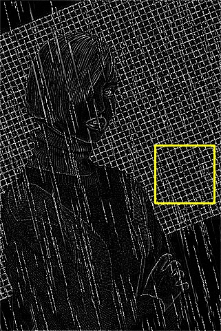
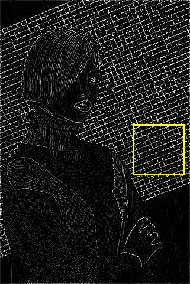
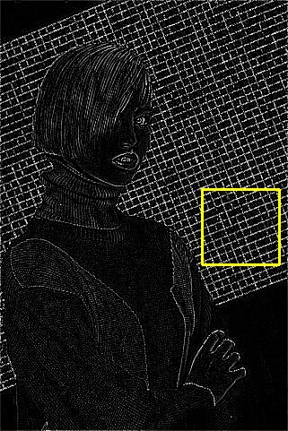
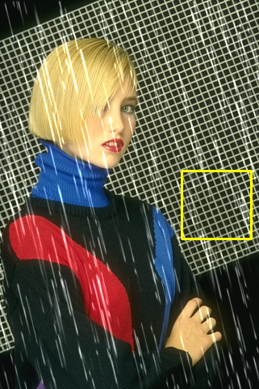

# Single Image Deraining using a Recurrent Multi-scale Aggregation and Enhancement Network (ICME'19)
   [[pdf](https://github.com/nnUyi/ReMAEN/blob/master/paper/Single%20Image%20Deraining%20using%20a%20Recurrent%20Multi-scale%20Aggregation%20and%20Enhancement%20Network.pdf)]
   
   Youzhao Yang, [Hong Lu](http://homepage.fudan.edu.cn/honglu/en); School of Computer Science, Fudan University

# Abstract
   Single image deraining is an ill-posed inverse problem due to the presence of non-uniform rain shapes, directions, and densities in images. In this paper, we propose a novel progressive single image deraining method named Recurrent Multiscale Aggregation and Enhancement Network (ReMAEN). Differing from previous methods, ReMAEN contains a symmetric structure where recurrent blocks with shared channel attention are applied to select useful information collaboratively and remove rain streaks stage by stage. In ReMAEN, a Multi-scale Aggregation and Enhancement Block (MAEB) is constructed to detect multi-scale rain details. Moreover, to better leverage the rain details from rainy images, ReMAEN enables a symmetric skipping connection from low level to high level. Extensive experiments on synthetic and real-world datasets demonstrate that our method outperforms the state-of-the-art methods tremendously. Furthermore, ablation studies are conducted to show the improvements obtained by each module in ReMAEN.

<p align='center'></p>

# Dataset
## Synthetic Datasets
   | Datasets | #train | #test | label |
   | :------- | -----: | ----: | :-----: |
   | [Rain100L](https://github.com/nnUyi/DerainZoo/blob/master/DerainDatasets.md) | 200    | 100   | rain mask & rain map|
   | [Rain100H](https://github.com/nnUyi/DerainZoo/blob/master/DerainDatasets.md) | 1800   | 100   | rain mask & rain map|
   | [Rain800](https://github.com/nnUyi/DerainZoo/blob/master/DerainDatasets.md)  | 700    | 100   | -     |
   | [Rain1200](https://github.com/nnUyi/DerainZoo/blob/master/DerainDatasets.md) | 12000  | 1200  | rain density |
   | [Rain1400](https://github.com/nnUyi/DerainZoo/blob/master/DerainDatasets.md) | 12600  | 1400  | - |
   
## Real-World Datasets
   | Datasets | #train | #test | label |
   | :------- | :-----: | ----: | :-----: |
   | [Real-World](https://github.com/nnUyi/DerainZoo/blob/master/DerainDatasets.md) | - | 67 | - |

# Pre-trained Model
| Datasets | Pre-trained model |
| :------: | :---------------: |
| Rain100L | [model](https://github.com/nnUyi/ReMAEN/tree/master/codes/checkpoint/) |
| Rain100H | [model TAB](https://github.com/nnUyi/ReMAEN/tree/master/codes/checkpoint/) |
| Rain800 | [model TAB](https://github.com/nnUyi/ReMAEN/tree/master/codes/checkpoint/) |
| Rain1200 | [model TAB](https://github.com/nnUyi/ReMAEN/tree/master/codes/checkpoint/) |
| Rain1400 | [model TAB](https://github.com/nnUyi/ReMAEN/tree/master/codes/checkpoint/) |

# Requirements
   - python 3.6.5
   - opencv 3.4.2
   - numpy 1.14.3
   - argparse 1.1
   - tensorflow_gpu >=1.4.0 & < 2.0

# Usages
   - **Clone this repo**
   ```
      $ git clone https://github.com/nnUyi/ReMAEN
      $ cd ReMAEN
   ```
   
   - **Test**
   ```
      $ CUDA_VISIBLE_DEVICES=0 python main.py --is_testing True
                                              --train_dataset Rain100L
                                              --test_dataset Rain100L
                                              --trainset_size 200
                                              --testset_size 100
                                              --batch_size 32
   ```
   
   - **Train**
   ```
      $ CUDA_VISIBLE_DEVICES=0 python main.py --is_training True
                                              --train_dataset Rain100L
                                              --test_dataset Rain100L
                                              --trainset_size 200
                                              --testset_size 100
                                              --iterations 40000
                                              --lr 0.001
                                              --batch_size 32
   ```
   - **Where should your datasets place?**
      - In the ***32rd and 33rd lines of settings.py***, you can see the --data_path and --test_path settings. You should download the datasets (or putting your own dataset) in the target path.

# Results
## Recurrent rain removal analysis
   <div align="center">
      
      
   </div>
      
## Edge loss analysis
   | Rainy | w/o edge loss | with edge loss | ground truth |
   | :-----: | :-----: | :----: | :-----: |
   |  | |  |  ||
   |  | |  |  ||
   
## Average PSNR and SSIM values on five synthetic datasets
   | Methods | Rain100L | Rain100H | Rain800 | Rain1200 | Rain1400 |
   | :-----: | :-----: | :----: | :-----: | :-----: | :-----: |
   | -- | PSNR/SSIM | PSNR/SSIM | PSNR/SSIM | PSNR/SSIM | PSNR/SSIM |
   | JORDER (CVPR'17)[1] | 36.11/0.970 | 22.15/0.674 | 22.24/0.776 | 24.32/0.862 | 27.55/0.853 |
   | DID-MDN (CVPR'18)[2] | 25.70/0.858 | 17.39/0.612 | 21.89/0.795 | 27.95/0.908 | 27.99/0.869 |
   | DualCNN (CVPR'18)[3] | 26.87/0.860 | 14.23/0.468 | 24.11/0.821 | 23.38/0.787 | 24.98/0.838 |
   | RESCAN (ECCV'18)[4] | 36.64/0.975 | 26.45/0.846 | 24.09/0.841 | 29.95/0.884 | 28.57/0.891 |
   | **OURS (ICME'19)** | **37.80/0.982** | **28.97/0.884** | **26.86/0.854** | **32.50/0.911** | **32.31/0.916** |

# References
[1] Wenhan Yang, Robby T. Tan, Jiashi Feng, Jiaying Liu, Zongming Guo, and Shuicheng Yan, “Deep joint rain detection and removal from a single image,” in Proceedings of the IEEE Conference on Computer Vision and Pattern Recognition, 2017, pp. 1357–1366.

[2] He Zhang and Vishal M. Patel, “Density-aware single image deraining using a multi-stream dense network,” in The IEEE Conference on Computer Vision and Pattern Recognition, 2018, pp. 695–704.

[3] Jinshan Pan, Sifei Liu, Deqing Sun, Jiawei Zhang, Yang Liu, Jimmy Ren, Zechao Li, Jinhui Tang, Huchuan Lu, and Yu-Wing Tai, “Learning dual convolutional neural networks for low-level vision,” in Proceedings of the IEEE Conference on Computer Vision and Pattern Recognition, 2018, pp. 3070–3079.

[4] Xia Li, Jianlong Wu, Zhouchen Lin, Hong Liu, and Hongbin Zha, “Recurrent squeeze-and-excitation context aggregation net for single image deraining,” in The European Conference on Computer Vision (ECCV), 2018, pp. 262–277.

# Acknowledgements
   - This work was supported in part by National Natural Science Foundation of China (No. U1509206).

# Citation
**If you find the resource useful, please cite the following:**
```
   @inproceedings{yang2019single,
      title={Single Image Deraining using a Recurrent Multi-scale Aggregation and Enhancement Network},
      author={Yang, Youzhao and Lu, Hong},   
      booktitle={IEEE International Conference on Multimedia and Expo (ICME)},
      year={2019}
   }
```
